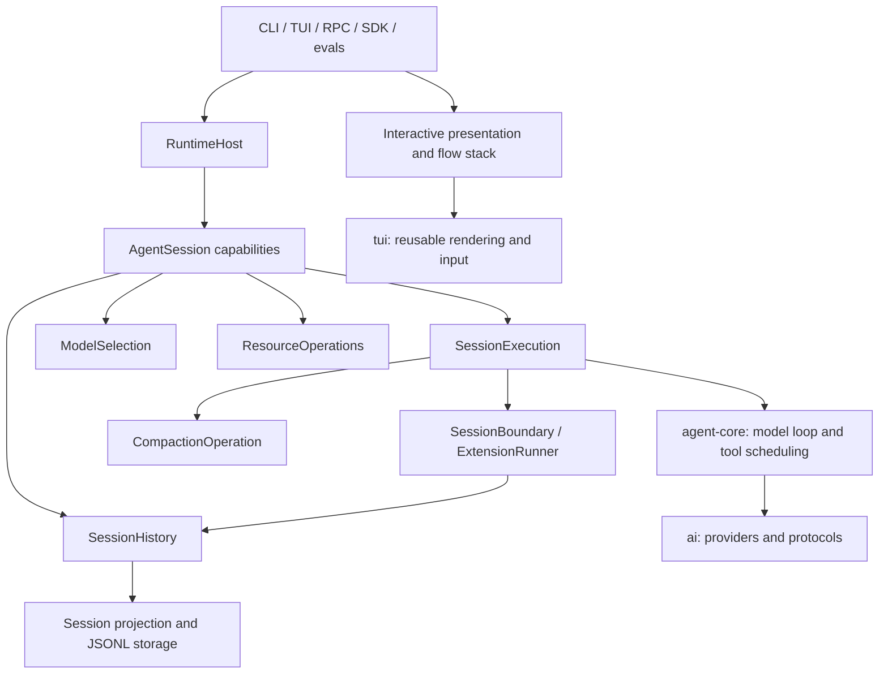

# Candy architecture

Candy has one conversation runtime shared by the CLI, terminal UI, RPC, SDK, and evaluation harness. Package boundaries remain internal dependency boundaries. Product and interaction rules live in [DESIGN.md](DESIGN.md); development and validation rules live in [CONTRIBUTING.md](CONTRIBUTING.md).

## State ownership

| Owner | State and operations |
|---|---|
| `SessionHistory` | Committed entries, session tree, selected branch, JSONL persistence, migrations, and context projection. |
| `SessionExecution` | Active response, steering and follow-up queues, pending input during compaction, cancellation, retry, overflow recovery, shell execution, and final settlement. |
| `ModelSelection` | Current model, thinking level, and their committed selection records. Explicit defaults are saved separately. |
| `ResourceOperations` | Current tool selection, discovered resource inventory, configuration edits, and resource reload. |
| `RuntimeHost` | Current session and services, serialized session replacement, resource lifetime, and shutdown. |
| Interactive presentation | Transcript projection and streaming display, pages, focus, return locations, drafts, and viewport position. `InteractiveFlowStack` owns mounted flow lifetime. |

`AgentSession` groups `execution`, `history`, `selection`, and `resources`. It does not forward their methods. The SDK returns restricted runtime capability objects with stable identity for each session, and exposes model catalog and settings operations at runtime scope. Its history capability reads committed state and exports it; writes go through business operations. The low-level `Agent`, mutable history manager, resource loader, and service assembly remain internal to the product runtime.

History stores facts after commit. The execution's active streamed message is temporary; it is not another transcript. Requests rebuild context from history. Queue storage belongs to execution and is passed to agent-core as `AgentInputs`.

## Dependencies

Core modules do not depend on terminal presentation. Agent-core does not depend on coding-agent or TUI. Providers implement their own wire protocols. Runtime services establish settings, authentication, models, and resources before selecting startup state and creating the session. CLI trust interaction and startup arguments enter the same internal builder used by the SDK.

Session file discovery lives in `session-discovery.ts`; entry definitions and validation live in `session-records.ts` and `session-validation.ts`. Committed tree queries and export preparation use `session-queries.ts`. Discovery does not acquire ownership of the active branch.

## One execution

1. Execution accepts input, resolves commands and resources, and commits accepted conversation input. While another response or compaction is active, execution owns the queued input.
2. The fixed agent host obtains projected history and prepares the model request. Request-context extension handlers operate on the request projection.
3. Agent-core streams a temporary assistant message and schedules tools. Tool-call interception occurs before execution; tool-result interception occurs before committing the final result.
4. Each final assistant or tool-result message is committed once. Consumer notifications reference the committed record. Streaming updates never commit partial copies.
5. After the reply and its tool results are committed, `turn_end` handlers run in registration order. Each handler's additions are validated before they are written, and the following handler sees the committed additions.
6. A continuation requires runnable model context, including matching tool calls and results. Tool scheduling, queued input, and extension continuation satisfy a single next request. Cancellation and error responses do not accept extension continuation.
7. Execution schedules core-owned retry, compaction, or overflow recovery where required, drains pending records at the appropriate boundary, and publishes `agent_settled` once when the whole execution finishes.

`SessionBoundary` validates and applies `custom`, `custom_message`, and `context_edit` drafts. Compaction records belong to core. The JSONL representation of context edits, summaries, and historical metadata remains unchanged. Invalid continuation is reported as an error; it does not start an extra request.

Shell requests from SDK, RPC, and TUI call `execution.executeBash()`. That operation owns `user_bash` interception, cancellation, output notifications, and committing the result. Results produced while a model response is active wait until the response finishes so tool-call/result ordering stays intact.

## Session replacement and resource lifetime

Runtime serializes new, resume, fork, clone, import, and disposal operations. Before-switch and before-fork handlers can cancel the corresponding operation.

Runtime creates the candidate session before closing the current session. Candidate creation failure releases candidate resources and leaves the current session usable. Once current-session shutdown starts, runtime settles active execution, delivers shutdown notification, invalidates its extension contexts and presentation flows, and releases its resources. Failure during this phase is reported explicitly; runtime does not claim to restore a session whose shutdown has already started.

After successful teardown, runtime installs the candidate, rebinds the host and subscribers, and emits the candidate's start event. Rebind or start failure is surfaced and candidate cleanup is awaited. Runtime-owned model services are released on disposal; injected model services remain caller-owned. Resource reload loads settings and resources before shutting down the old extensions. A load failure leaves their contexts usable. Successful reload invalidates the old extension contexts before binding the newly discovered extensions.

Interactive flows share a stack. A child flow suspends its parent; cancellation aborts and disposes the child and resumes the parent. Session invalidation aborts and disposes the stack without resuming old pages. Authentication captures the model runtime and flow generation that started it, so a late result cannot update a replacement session's page.

## Settings and extensions

The typed settings catalog defines each setting's ID, interactive choices, default, storage location, readable value, and writable scope. TUI and RPC share read, commit, and clear operations. Explicit readers handle global-only values, environment variables, and normalization; valid persisted numeric values are not restricted to menu choices. Settings storage preserves inheritance, existing field names, and atomic file commits.

Extensions have separate registration and runtime APIs. Registration adds tools, commands, lifecycle handlers, and native `Provider` objects. Runtime actions are bound once after loading, and captured contexts reject use after replacement or reload. `turn_end` is the only boundary that can request another response. `agent_settled` is notification-only.

The host presents extension selection, confirmation, input, multi-line editing, notification, text status, and text widgets. Arbitrary component/rendering injection, main-editor manipulation, raw keyboard interception, completion wrapping, theme manipulation, raw provider request/response interception, and legacy `ProviderConfig` registration are removed. See the [extension contract](packages/coding-agent/docs/extensions.md), [SDK](packages/coding-agent/docs/sdk.md), and [RPC extension UI](packages/coding-agent/docs/rpc-extension-ui.md) for supported interfaces.

## Compatibility and validation

Internal and extension APIs may change when their callers migrate together. Session JSONL and configuration formats retain their existing migrations and persisted fields. Tests use the faux provider and isolated resources, covering commit order, queues, cancellation, recovery, extension boundaries, replacement failure, stale contexts, settings inheritance, and terminal flow lifetime.

See the [interactive testing guide](.candy/skills/interactive-testing.md) for Windows PTY and Linux/tmux smoke testing. Broad non-e2e coverage uses `./test.sh`; `npm run check` validates formatting, dependencies, imports, entry graphs, architecture boundaries, shrinkwrap, and types.
