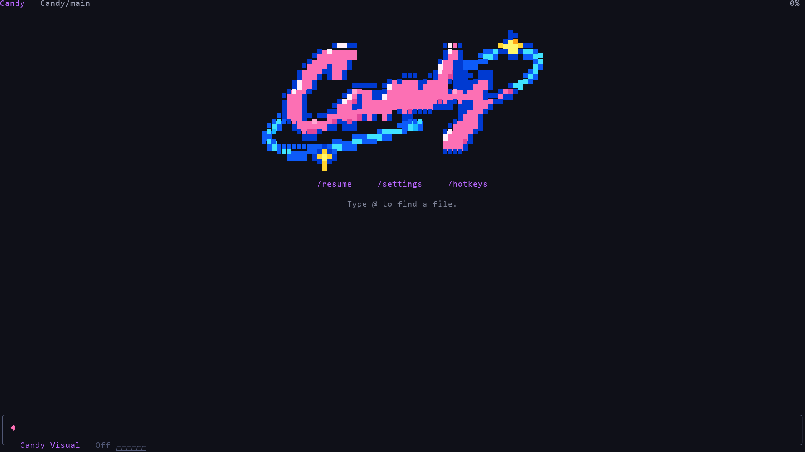

# Use candy in the terminal

Run `candy` from the folder you want to work in. candy uses that folder to discover files, instructions, and configuration, and to group saved sessions. If you have not installed candy or chosen a model yet, follow the [Quickstart](quickstart.md).

candy may ask whether you trust the working folder before loading its project resources. See [Project trust](security.md#understand-project-trust).

<p align="center"></p>

The transcript separates conversation from machine activity: your messages start with a pink diamond, assistant prose remains unboxed, and consecutive tool calls form an activity line with status symbols. You write messages in the editor. Its bottom border shows the current model and thinking level; the top bar tracks context usage.

## Enter a prompt

Type a request and press `Enter` to send it. Use `Shift+Enter` to add a line, or press `Ctrl+G` to work on a longer prompt in your configured external editor.

To include files or images:

- Type `@` to search for a file and add it to your prompt.
- Press `Tab` to complete a path.
- Paste an image or drag it into a compatible terminal.

File suggestions appear above the editor, with the selected file's full path below the list. A long paste becomes an atomic `[paste #…]` marker; an image pasted from the clipboard becomes an `[Image #…]` marker showing its dimensions. Move, delete, or undo either marker as one unit. candy expands it to the original content or image path when sending. Click an image marker to see its stored path.

## Follow candy's work

candy shows each tool call and result in execution order. Completed reads and searches show a compact result summary. Edits, writes, and shell commands show up to five terminal rows by default; errors show up to twelve. Click a tool's title to expand that call. Press `Ctrl+O` to expand or collapse details across the transcript, or change the tool preview limit to 10 or 20 rows in Command. Cancelled calls have their own status. Thinking blocks start collapsed with a short excerpt; press `Ctrl+T` to change their visibility.

The home screen shows the Candy logo and a short list of controls. Loaded resources render as a one-line summary; verbose startup also lists their names and paths. The editor border, six-step meter, and moving trails reflect the selected thinking level: gray at Off and Minimal, blue at Low, pink at Medium, cyan at High, and flowing color with brighter highlights at Xhigh and Max. Shell mode uses yellow for its command title. Retry, compaction, and branch-summary status appears on the frame's top edge.

Open Command to change **UI animations** or **Animation intensity**. With animations off, panels and the frame appear immediately; level colors and status text remain visible. See [Terminal and display settings](settings.md#terminal-and-display).

candy does not ask before every tool call. Review commands and changed files, and use a sandbox for untrusted or unattended work. See [Security](security.md).

## Change direction

You can send more input while candy is working:

| What you want | Action |
|---|---|
| Adjust the current task | Type a message and press `Enter` |
| Add work after the current task | Type a message and press `Alt+Enter` |
| Return queued messages to the editor | Press `Alt+Up` |
| Stop the current task | Press `Escape` |

A message sent with `Enter` waits until the current response and its tool calls finish, then guides the next response. A follow-up sent with `Alt+Enter` waits until candy finishes the current task. Aborting returns queued messages to the editor.

The queue shows up to three pending messages and a total count. Expand it to inspect the rest. Steering and follow-up messages have separate labels.

Windows Terminal reserves some Alt shortcuts. See [Terminal Setup](terminal-setup.md) for the Windows alternatives.

## Powerbar and Command

Press `Ctrl+L` or click the editor's bottom border to open the Powerbar. `Left` and `Right` browse models or thinking levels. `Tab` switches between Model and Thinking. `Enter` applies the highlighted choice; `Escape` closes the selector.

From Model, press `Up` for Sources or `Down` for Details of the highlighted model. Sources manages providers, authentication, catalogs, and which models appear in quick selection. Details shows the model's capabilities and its default model, thinking, and compaction options. You can inspect Details without changing the active model.

In Sources, press `Space` to include or exclude a model from quick selection. A provider can be selected or cleared as a group. `Ctrl+A` includes all models matching the current search; `Ctrl+D` clears those matches. Neither key changes the scope when nothing matches. `Tab` moves between search and the list; clicking a row focuses it.

From Thinking, press `Up` for History or `Down` for Agent. History contains context, compaction, session details, rename, tree navigation, fork, clone, and switching sessions. Agent contains Instructions, Skills, Tools, and Behavior. Closing a page returns to the selector from which you opened it.

In Agent → Tools, change the current session's active tools or save them as the default for new sessions. **Use inherited default tools** clears the saved list; the page confirms when a change is saved.

With an empty ordinary editor, type `/` to open Command. Search commands and individual settings there. A single `/` key opens the menu; a pasted slash or slash-prefixed text in a message remains ordinary text. `Enter` runs resource commands without arguments and opens required local arguments. Press `Right` on a resource command to enter optional arguments. `Backspace` on an empty argument returns to the list; on an empty search it closes Command. `Escape` returns one level. Prompt templates, skills, and extensions appear in Command when loaded. Skills appear under their own names, with their source shown beside them. See the [Commands reference](commands.md).

## Continue or start over

candy saves sessions automatically unless session persistence is disabled.

Use History to resume another saved session, rename the current session, inspect its details, navigate its tree, fork or clone, and compact context. Rename opens with the current session name filled in. Command's **New** action starts a new session. See [Sessions and Context](sessions.md) for these workflows.

After leaving candy, run `candy --continue` from the same folder to resume its most recent session.

## Run a terminal command

With an empty editor, press `!` to enter Shell mode, type a command, and press `Enter`. Its output is included in the conversation:

```text
git status
```

Press `!` again while the Shell editor is empty to enter Shell · No Context. Commands in that mode run without sending output to the model. An empty-editor Backspace or Escape steps back one mode.

Shell commands appear as their own activity segment. The output preview keeps the most recent rows; expand the entry to read the full result.

## Copy or export results

Press `Ctrl+X` or choose **Copy** in Command to copy the last assistant response. Choose **Export** to save the session as HTML or JSONL.

## Adjust the terminal

Candy runs fullscreen: the editor and status area stay fixed while the transcript scrolls within the terminal window. A title bar at the top shows the project, git branch, and session name.

Terminal support for mouse input, keyboard shortcuts, and inline images varies. See [Terminal Setup](terminal-setup.md) for platform-specific configuration and [Keybindings](keybindings.md) for every configurable shortcut. Choose **Hotkeys** in Command to inspect the shortcuts active in your current session.

Use the transcript search shortcut from [Keybindings](keybindings.md#fullscreen) to search currently rendered text. Collapsed content is excluded until expanded. Search opens above the editor; closing it restores your draft and keeps the last viewed position.

## Collect diagnostic information

When troubleshooting terminal rendering or conversation state, choose **Debug** in Command. candy writes the rendered terminal lines and current session messages to `candy-debug.log` in your [agent directory](configuration.md#agent-directory).

Review this file before sharing it. It can contain prompts, model responses, tool output, file contents, and terminal data.
